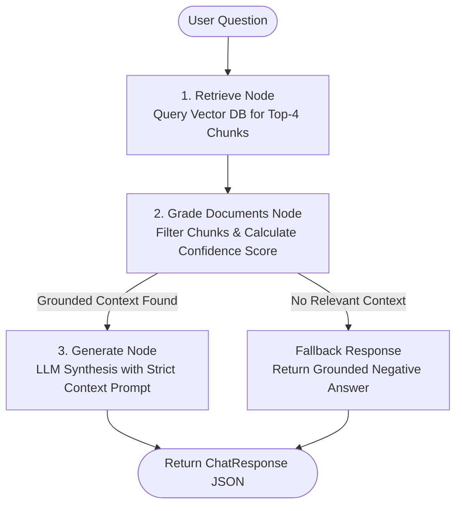

# 🤖 Agentic AI eBook RAG Assistant

A production-ready Retrieval-Augmented Generation (RAG) chatbot system built with **Python**, **LangGraph**, **FastAPI**, **Streamlit**, and **ChromaDB**. Grounded strictly on the [Agentic AI eBook](https://konverge.ai/pdf/Ebook-Agentic-AI.pdf).

---

## 🌟 Key Features

- **Automated Ingestion Pipeline**: Auto-downloads the target eBook, extracts text using PyPDF/pdfplumber, chunks text (`chunk_size=800`, `chunk_overlap=150`), and indexes embeddings into vector storage.
- **Stateful LangGraph Workflow**: Implements a modular 3-node RAG pipeline (`Retrieve` ➔ `Grade Documents` ➔ `Generate`) ensuring grounded responses with zero hallucination.
- **Confidence Scoring Matrix**: Calculates an overall grounded confidence score (0.0 to 1.0) based on vector distance metrics and chunk relevance thresholds.
- **Production FastAPI REST Server**: Asynchronous API endpoint (`POST /chat`) returning structured answers, context metadata, page numbers, and similarity metrics.
- **Interactive Streamlit UI**: Chat interface featuring message history, metric badges, source citations, collapsible chunk inspection, and quick sample evaluation queries.
- **Flexible Provider Support**: Works with OpenAI (`gpt-4o-mini`), Google Gemini (`gemini-1.5-flash`), or free local HuggingFace embeddings (`all-MiniLM-L6-v2`).

---

## 🏗️ Architecture & Workflow

```
                          ┌───────────────────────────┐
                          │   Agentic AI eBook PDF    │
                          │ (Ebook-Agentic-AI.pdf)    │
                          └─────────────┬─────────────┘
                                        │
                                        ▼
                          ┌───────────────────────────┐
                          │    Recursive Chunking     │
                          │   (800 size / 150 overlap)│
                          └─────────────┬─────────────┘
                                        │
                                        ▼
                          ┌───────────────────────────┐
                          │ ChromaDB Vector Indexing  │
                          │ (HuggingFace / OpenAI Embed)│
                          └─────────────┬─────────────┘
                                        │
                                        ▼
┌───────────────────────────────────────────────────────────────────────────────┐
│                          LangGraph RAG State Pipeline                          │
│                                                                               │
│   ┌──────────────┐          ┌──────────────────┐          ┌───────────────┐   │
│   │  retrieve    │ ───────► │ grade_documents  │ ───────► │   generate    │   │
│   │ (Top-k DB)   │          │(Threshold Filter)│          │(Strict Prompt)│   │
│   └──────────────┘          └──────────────────┘          └───────────────┘   │
└──────────────────────────────────────┬────────────────────────────────────────┘
                                       │
                    ┌──────────────────┴──────────────────┐
                    ▼                                     ▼
         ┌─────────────────────┐               ┌─────────────────────┐
         │ FastAPI REST Server │ ────────────► │ Streamlit Chat UI   │
         │   (POST /chat)      │               │   (Port 8501)       │
         └─────────────────────┘               └─────────────────────┘
```

### LangGraph Workflow Topology (Mermaid)



---

## 📁 Repository Structure

```
agentic-ai-rag-bot/
├── data/
│   └── Ebook-Agentic-AI.pdf        # Downloaded automatically by ingestion
├── src/
│   ├── __init__.py
│   ├── config.py                  # Pydantic Settings & environment variables
│   ├── ingest.py                  # Downloader, text parser, chunker & ChromaDB indexer
│   ├── graph.py                   # LangGraph stateful RAG workflow
│   ├── schemas.py                 # Pydantic request/response schemas
│   └── utils.py                   # Distance normalizers & confidence score engine
├── main.py                        # FastAPI backend REST API server
├── app.py                         # Streamlit interactive frontend application
├── requirements.txt               # Dependencies list
├── .env.example                   # Environment configuration template
├── README.md                      # Documentation & setup guide
└── sample_queries.json            # 6 evaluation queries with target topics
```

---

## ⚡ Quick Start Guide

### 1. Prerequisites
- Python **3.10+**
- (Optional) `OPENAI_API_KEY` or `GOOGLE_API_KEY` for LLM generation. Free HuggingFace embeddings are used by default if no key is provided.

### 2. Environment Setup
Clone the repository and create a virtual environment:

```bash
# Clone the repository
git clone https://github.com/your-org/agentic-ai-rag-bot.git
cd agentic-ai-rag-bot

# Create and activate virtual environment
python -m venv venv
# On Windows:
venv\Scripts\activate
# On Linux/macOS:
source venv/bin/activate

# Install dependencies
pip install -r requirements.txt
```

### 3. Configure `.env`
Copy `.env.example` to `.env`:

```bash
cp .env.example .env
```

Edit `.env` to configure your preferred settings:
```env
EMBEDDING_PROVIDER=huggingface
EMBEDDING_MODEL=all-MiniLM-L6-v2
LLM_PROVIDER=openai
LLM_MODEL=gpt-4o-mini
OPENAI_API_KEY=your_openai_api_key_here
```

---

## 🚀 Running the Application

### Step 1: Run Document Ingestion
Ingest the eBook into the ChromaDB vector database:

```bash
python -m src.ingest
```
*Note: This automatically downloads `Ebook-Agentic-AI.pdf` into `data/` if not present, extracts text, chunks it, and builds the vector store.*

### Step 2: Start the FastAPI Backend Server
Launch the FastAPI REST API:

```bash
uvicorn main:app --reload --host 0.0.0.0 --port 8000
```
- API Documentation: [http://localhost:8000/docs](http://localhost:8000/docs)
- Health Status: [http://localhost:8000/health](http://localhost:8000/health)

### Step 3: Start the Streamlit UI
In a separate terminal tab:

```bash
streamlit run app.py
```
Open your browser at `http://localhost:8501`.

---

## 🌐 API Reference

### `POST /chat`
Executes the RAG pipeline for a user question.

#### Request Body
```json
{
  "question": "What is the ReAct pattern in Agentic AI systems?"
}
```

#### Example `curl` Call
```bash
curl -X POST "http://localhost:8000/chat" \
     -H "Content-Type: application/json" \
     -d '{"question": "What is the ReAct pattern in Agentic AI systems?"}'
```

#### Response Body
```json
{
  "answer": "The ReAct (Reasoning and Acting) pattern combines reasoning trace generation with task-specific action execution in AI agents...",
  "retrieved_chunks": [
    {
      "content": "ReAct prompt engineering enables agents to execute dynamic reasoning loops...",
      "metadata": {
        "page": 12,
        "source": "Ebook-Agentic-AI.pdf",
        "chunk_id": "page_12_chunk_0"
      },
      "relevance_score": 0.88
    }
  ],
  "confidence_score": 0.88
}
```

### `GET /health`
Returns the status of the backend service and vector store statistics.

---

## 📊 Sample Evaluation Queries

The repository includes `sample_queries.json` with 6 evaluation queries specifically targeted at the Agentic AI eBook:

| # | Query | Category | Key Target Topics |
|---|-------|----------|-------------------|
| 1 | **What is the ReAct pattern in Agentic AI systems?** | Architecture & Patterns | Reasoning & Acting loop, Thought-Action-Observation |
| 2 | **How do multi-agent collaboration frameworks function?** | Multi-Agent Systems | Role specialization, Inter-agent communication |
| 3 | **What are the primary mechanisms for tool usage and execution by AI agents?** | Tool Integration | Function calling, API integration, Sandboxed execution |
| 4 | **Explain the concept of reflection and self-correction architecture in agentic workflows.** | Self-Improvement | Critique nodes, Iterative refinement, Error recovery |
| 5 | **What is the difference between single-agent systems and multi-agent workflows?** | Comparative Analysis | Context window efficiency, Task specialization |
| 6 | **How does human-in-the-loop governance improve AI agent safety and reliability?** | Safety & Governance | Approval gates, Risk mitigation, Feedback loops |

---

## 🧪 Testing & Verification

Run ingestion and verify backend response directly:

```bash
# Test ingestion script
python -m src.ingest

# Run backend health check
curl http://localhost:8000/health
```

---

## 📄 License

This repository is built for demonstration and evaluation purposes. All content is derived from the *Agentic AI eBook*.
# Rag-appening

